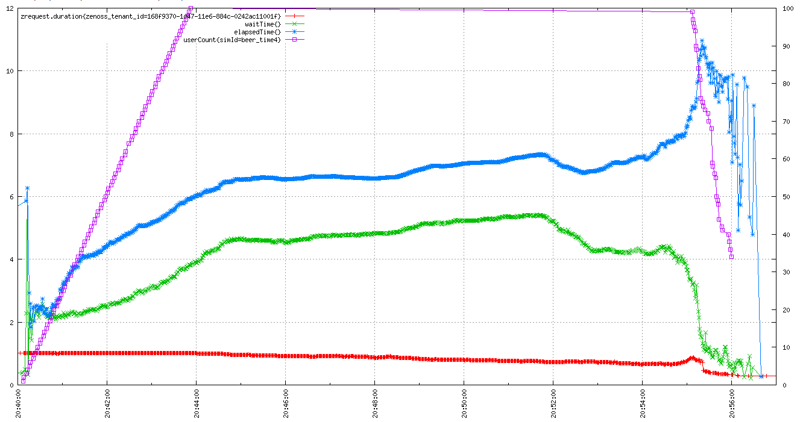
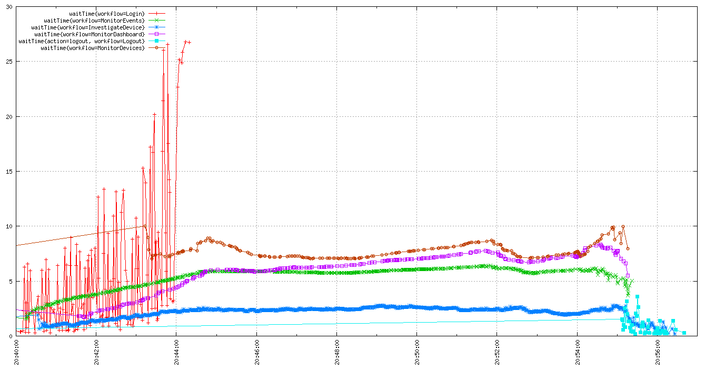

# Zenoss User Simulator
This tool simulators user actions against the Zenoss UI. It also provides convenient ways to store and retrieve stats about the simulated user experience.

## Usage
A Dockerfile is included that will build an image which can point simulated users at a Zenoss instance. First build the Dockerfile

    docker build -t zenoss/usersim:v2 .

Once the build is complete, the image can be launched and command line arguments passed in via sim.sh

    # first arg is number of simulated users, second arg is zenoss password
    ./sim.sh 1 ZenossPassword

`sim.sh` assumes you want to use zenoss user `zenny` and that you have `$(pwd)/log` available to write logs to.

Or if you prefer, you can wrangle absurdly long commands like this:

    docker run --privileged -t \
        -v $(pwd)/log:/root/log \
        -v /dev/shm:/dev/shm \
        -v /etc/hosts:/etc/hosts \
        zenoss/usersim:v2 \
        -u https://zenoss5.graveyard.zenoss.loc \
        -n zenny \
        -p **** \
        -c 25 \
        --duration 900 \
        --log-dir ./log \
        --tsdb-url https://opentsdb.graveyard \
        --workflows="MonitorEvents, InvestigateDevice, MonitorDashboard, InvestigateDevice, MonitorDevices"

Note that this image must be run as `privileged` and `/dev/shm` must be bindmounted for chrome to work properly. Mounting `/etc/hosts` into the image is useful because the Zenoss instance may only be reachable by hostname

To run directly in python, install dependencies (`Xvfb` and `chromedriver` for the OS, and `selenium` and `xvfbwrapper` for python), then kick it off with:

    python -u sim.py \
        -u https://zenoss5.graveyard.zenoss.loc \
        -n zenny \
        -p **** \
        -c 25 \
        --duration 900 \
        --headless \
        --log-dir $(pwd)/log \
        --tsdb-url https://opentsdb.graveyard \
        --workflows="MonitorEvents, InvestigateDevice, MonitorDashboard, InvestigateDevice, MonitorDevices"

For configuration options, try `python sim.py --help` or `docker run zenoss/usersim:v2`.

## Getting Stats
All the stats from the run are pushed to the opentsdb that is provided when the run is started. The stats track the number of users, amount of time a user spends waiting for things to load, thinking, and total time performing workflows. If zope logging is in place, this can produce a complete picture of what's affecting user experience.

Purple rectangles show user count, blue asterisks are elapsed time spent working, green crosses are time spent waiting, red lines are server request duration.

These results show the time the user spent waiting, where each series is a specific workflow. The red lines at the beginning are the Log In workflow. The Monitor Devices workflow is the dark red series that produces the most wait time.

The key stats are `waitTime`, `elapsedTime`, and `userCount`. The tsdb graphing UI will fill in the relevant tags. Specifically, try setting the `action` tag to `*` to break out the results but action.

Finally, the `userCount` stat has to be aggregated after a run is complete. This, as well as generating a number of other useful stats, can be done done by running `get_metrics.py`. An example run:

    python get_metrics.py -s 2016/06/16-20:40:00 \
        -e 2016/06/16-20:56:00 \
        -i pizza_time \
        -u https://opentsdb.graveyard \
        -d

Note the sim id flag `-i` is used to sync runs across multiple machines. One is automatically generated by the user simulator and appears at the beginning of the run, and should be provided to `get_metrics.py`.

You can get mo' help with good old fashioned `python get_metrics.py --help`.

## Tell me more!
Zenoss User Simulator is similar to a functional test runner, but aims to perform specific tasks and workflows at a more general level rather than verify that specific details behave in an expected way. A **User** is given a list of **Workflows** to perform. Each Workflow interacts with one or more **Pages**. Pages know precisely how to accomplish a task, and push results to opentsdb.

For example, a user workflow may be to review all critical events that occurred overnight. The workflow tasks could be: view events, filter to show only critical severity, sort by last seen, look at results.

Viewing the events is a page action that breaks down to navigating to the events page. This is part of the NavigationPage (an unusual page in that it is always present). The workflow doesn't need to know the details of how to view events, just that it can tell the navigation page to take us there.

The next two steps are to filter and sort the events. These are page actions of the EventPage, so the workflow calls each and the page action returns results.

The final step is to look at the results. The EventPage can return a list of visible events, and the workflow can iterate through them and make choices about what to do with them. For instance, the current user might be named "Bob", and an event summary might say "BOB LOOK AT THIS RIGHT NOW". The workflow can choose then to view the details of the event. In the same way a user might take a few moments to gather info with their eyeballs, our user simulator can take a few moments to think. Intentional pauses like this makes the user more authentic in that more idle time occurs where the UI is still making requests to the backend and putting load on the server.

Note that the concept of the web browser is entirely encapsulated in page actions. No WebElements, selenium exceptions or other webby things should make it outside of Pages and page actions.

## Some Notes
**Pages**
Pages and page actions are the nitty gritty of selenium and the DOM. Selenium and DOM related stuff should not escape outside of pages.

* Inside of pages, use the `find`, `findMany`, `wait` and similar helper functions instead of directly calling selenium methods. Maintaining page actions when the framework changes will be much simpler.
* Write page actions in a way that does not indicate that they do browser-y stuff. Bad page action: `clickAcknowledgeButton`. Good page action `acknowledgeEvent`.
* A page action should not return until it is sure the page is ready. Find some DOM element or something to look for to ensure the page is actually ready and not merely loaded
* When returning results from a page action, a) it must not be selenium objects and b) make sure the result contains something that can be re-queried from the DOM
* Be sure to catch any selenium exceptions and return `PageActionException` instead.
* Use timers to track stats for all public page actions, but don't put timers inside private functions

**Workflows**
Workflows outline the pages actions to perform to complete a task. Workflows should know nothing of the DOM or selenium.

* Workflows were designed to be "smart". Use page actions that result results (like a list of events) and make intelligent decisions on how to interact with them.
